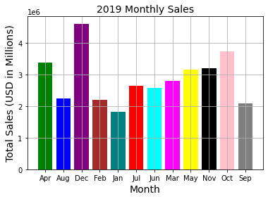
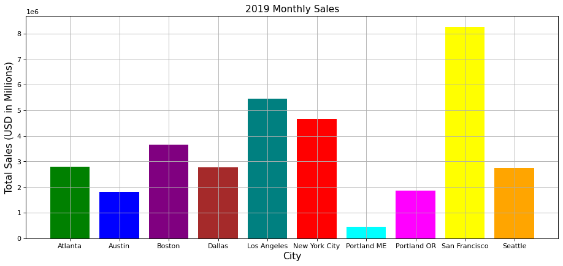
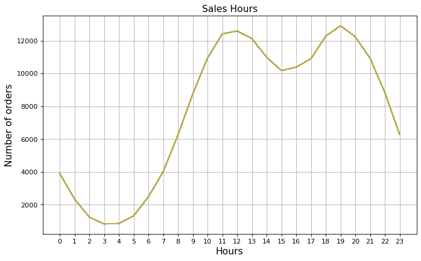
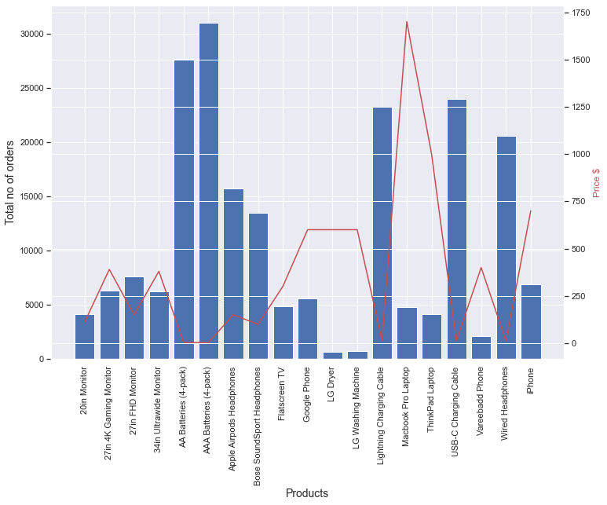

# Sales-Analysis-Using-Python-Pandas-and-Matplotlib

This is a sales analysis project created by using python pandas and matplotlib to analyse and extract useful business insights from a full calendar year worth of sales transactions. The data contains hundreds of thousands of electronics store purchases broken down by month, product type, cost, purchase address, etc. 

## Key Insights to be Explored

Once we have cleaned up our data a bit, we move the data exploration section. In this section we explore 5 high level business questions related to our data:
- What was the best month for sales? How much was earned that month?
- What city sold the most product?
- What time should we display advertisements to maximize the likelihood of customer’s buying product?
- What products are most often sold together?
- What product sold the most? Why do you think it sold the most?

## Approach

To answer these questions, we walk through the following steps which include many different pandas & matplotlib methods:
- Drop NaN values from DataFrame
- Removing rows based on a condition
- Change the type of columns (to_numeric, to_datetime, astype)
- Concatenating multiple csvs together to create a new DataFrame (pd.concat)
- Adding columns
- Parsing cells as strings to make new columns (.str)
- Using the .apply() method
- Using groupby to perform aggregate analysis
- Plotting bar charts and lines graphs to visualize our results
- Labelling our graphs

## Major observation from the data
1.	To answer What was the best month for sales and how much was earned that month, I did a bar chart showing total sales for each month, which revealed that December is the best performing month in that year, also did a sum of sales for the month of December and got $4,613,443.

  
2.	What city sold the most product? Created a new city column by extracting city name from the address strings and then creating a bar chart for total sales of each city. This revealed that San Francisco had highest sales.

 
3.	What time should we display advertisements to maximize the likelihood of customer’s buying product? Created a new column for hours by extracting the hour of the day from order date, then I plotted a line graph showing the number of orders made at all the hours of the day. This revealed that the hours 11am-12am and 7pm have the highest number of orders and would be good time for advertisements.

 
4.	What products are most often sold together? In order to get this insight, I had to create a new data frame containing all order ID’s that made more than one purchases, I further used combinations and Counter methods from itertools and collections modules to count all the times two products are sold together in the sales data, which revealed that IPhone and Lightning Charging Cable were the products mostly sold together.

5.	What product sold the most? Why do you think it sold the most? To answer this, I plotted a bar chart showing the quantity ordered and mean prices of each product sold, this revealed that the AAA Batteries (4-pack) was the most sold product and plotting a mean price line plot on the bar chart showed that the cheaper the price the more the products are sold.
 
 
